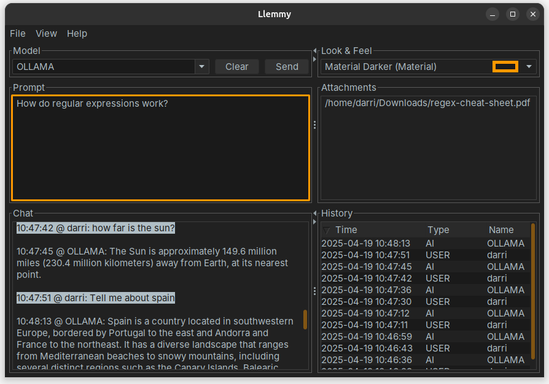

= Codion Llemmy Demo

A LLM chat demo application in ~1.200 lines of code, based on the https://codion.is[Codion application framework].

== Documentation

Build the tutorial by running this Gradle target:

[source,shell]
----
gradlew llemmy:asciidoctor
----

...and browse the tutorial here:
[source]
----
llemmy/build/docs/asciidoc/llemmy.html
----

== Build Llemmy

[source,shell]
----
gradlew llemmy:build
----

== Ollama Model

=== Run

Uses https://github.com/testcontainers/testcontainers-java[testcontainers] to download and run the latest local orca-mini Ollama model  (langchain4j/ollama-orca-mini:latest, ~2GB).

[source,shell]
----
gradlew ollama-model:run
----

=== Package

[source,shell]
----
gradlew ollama-model:jlink
gradlew ollama-model:jpackage
----

== Llemmy Ollama

=== Run

Runs the Llemmy application configured for the local Ollama model

[source,shell]
----
gradlew llemmy-ollama:run
----

=== Package

[source,shell]
----
gradlew llemmy-ollama:jlink
gradlew llemmy-ollama:jpackage
----

== Llemmy OpenAI

=== Run

Runs the Llemmy application configured for OpenAI models

[source,shell]
----
gradlew llemmy-openai:run
----

=== Package

[source,shell]
----
gradlew llemmy-openai:jlink
gradlew llemmy-openai:jpackage
----